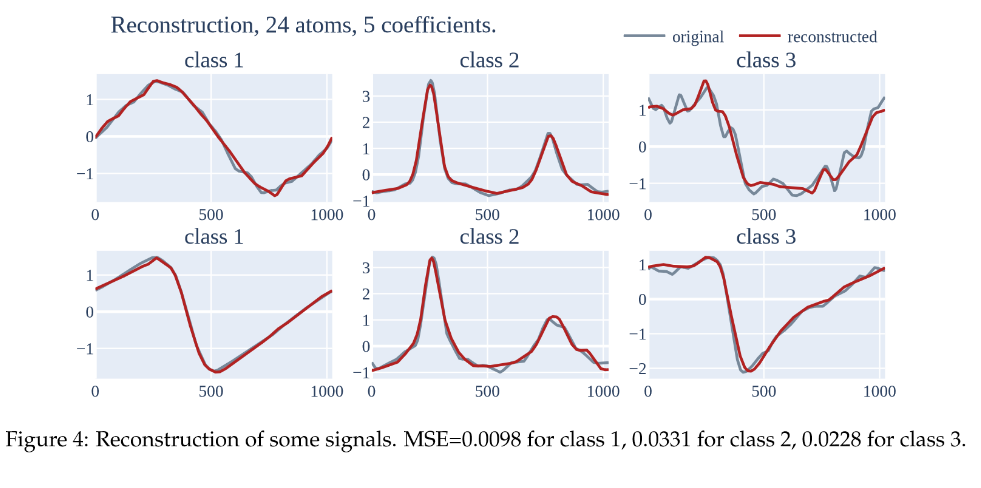

# mva-ts-project
MVA Time Series course mini-project.
The goal of this project was to study KSVD algorithm.

## Organization

- `ksvd.pdf`is the original article.
- `K-SVD-notebook.ipynb` is the notebook we used to make the experiments and the figures.
- `project_report.pdf`contains the main report.
